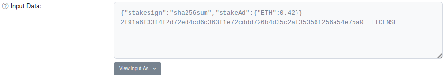

# stakesign

### Sign files via blockchain + put your money where your mouth is

This project helps open-source developers, and other DIY-types, who'd like to attach user-verifiable digital signatures to their work products (files, code, executables, Docker images, etc.). It provides a way to **sign with your cryptocurrency wallet**, instead of a separate GnuPG keypair or X.509 certificate.

It furthermore proposes that **signatures remain valid only while the signing address holds a *stake* of unspent cryptocurrency**. The stake bonds the publisher to keep their signing key safe & secure, even if they lose interest in the signed products; or otherwise, allows for its revocation with immediate, global effect. These properties aren't as easily achieved by other P2P signing mechanisms.

**Signatures are broadcast in public blockchain transactions,** providing an irrefutably timestamped audit trail, and a succinct delivery mechanism (transaction ID). Alternatively, one can communicate a signature off-chain and refer to the public ledger just to confirm the stake (foregoing the intrinsic audit trail).

Another salient property is that **this doesn't require dedicated software;** one can generate and verify signatures using standard blockchain tools and Unix programs. But, we've also prepared a Python command-line tool that smooths out the process.

### Quick start example

Ethereum transaction [0xd071c0e8fbcbcab8b92f9098c5250d7e1c003f222c94fe0729669bae02ae3acf](https://etherscan.io/tx/0xd071c0e8fbcbcab8b92f9098c5250d7e1c003f222c94fe0729669bae02ae3acf) is my signature for the MIT [LICENSE](https://github.com/mlin/stakesign/raw/main/LICENSE) file in this repo. Open the transaction link, expand **Click to see More**, then **View Input As > UTF-8** to find:

[](https://etherscan.io/tx/0xd071c0e8fbcbcab8b92f9098c5250d7e1c003f222c94fe0729669bae02ae3acf)

This is nothing more than [GNU sha256sum](https://www.gnu.org/software/coreutils/manual/html_node/sha2-utilities.html)'s output appended to a one-line JSON header. The header advises the recipient to reject the signature if the [ETH balance of the signing key](https://etherscan.io/address/0x83cee747e4bcff80938ea1056f925d1c24412f0b) is below 0.42. To verify this signature at the command line,

```
$ pip3 install stakesign
# on macOS, also: brew install coreutils
# coming soon: conda install -c conda-forge stakesign

# then download LICENSE and verify it:
$ wget https://github.com/mlin/stakesign/raw/main/LICENSE
$ stakesign verify 0xd071c0e8fbcbcab8b92f9098c5250d7e1c003f222c94fe0729669bae02ae3acf
Trusting ETH gateway:	https://cloudflare-eth.com
         Transaction:	0xd071c0e8fbcbcab8b92f9098c5250d7e1c003f222c94fe0729669bae02ae3acf
    Signer's address:	0x83Cee747E4BCFF80938eA1056F925d1c24412f0b
 Signature timestamp:	2020-12-25 08:14:44Z
Signer's balance now:	1.096695296	≥ 0.42 ETH from stakeAd	🗹
  Trusting local exe:	/usr/bin/sha256sum

LICENSE: OK

🗹	Success
```

`stakesign verify` looks up the signature through a public Ethereum gateway, displays the signing address and its current ETH balance, then runs `sha256sum` to verify the local file's contents against the signed digests. You just need to know that [0x83Cee747E4BCFF80938eA1056F925d1c24412f0b](https://etherscan.io/address/0x83cee747e4bcff80938ea1056f925d1c24412f0b) is in fact *my* key, e.g. as reported here and on [my homepage](https://www.mlin.net/). Try tampering with the local copy of LICENSE to see the tool reject it.

### Verifying manually

The tool doesn't really do anything interesting, and you don't have to trust it. To verify the signature manually, run `sha256sum` on your copy of LICENSE, [look up the public transaction data](https://etherscan.io/tx/0xd071c0e8fbcbcab8b92f9098c5250d7e1c003f222c94fe0729669bae02ae3acf) (**Click to see More**, **View As > UTF-8**) and check that:

1. your SHA256 file digest(s) match the published signature
2. the signature transaction's From address is what the publisher has announced
3. that address *currently* [holds an ETH balance](https://etherscan.io/address/0x83cee747e4bcff80938ea1056f925d1c24412f0b) evincing the signer's ongoing interest in securing it (perhaps, but not necessarily, the amount advertised inside the signature)

Additional subjective factors you could look into: (4) the signature transaction's timestamp seems within your expectations; (5) the public activity ledger for the signing address doesn't seem suspicious, e.g. signing tons of stuff the publisher isn't associated with.

If you're paranoid about our Etherscan links, then you can easily cross-reference similar sites for browsing the public blockchain (e.g. [1](https://ethplorer.io/tx/0xd071c0e8fbcbcab8b92f9098c5250d7e1c003f222c94fe0729669bae02ae3acf) [2](https://blockchair.com/ethereum/transaction/0xd071c0e8fbcbcab8b92f9098c5250d7e1c003f222c94fe0729669bae02ae3acf) [3](https://eth.btc.com/txinfo/0xd071c0e8fbcbcab8b92f9098c5250d7e1c003f222c94fe0729669bae02ae3acf) [4](https://www.blockchain.com/eth/tx/0xd071c0e8fbcbcab8b92f9098c5250d7e1c003f222c94fe0729669bae02ae3acf)); or even your local node.

### Signing files

First, you load an Ethereum address with ETH greater than the intended stake amount (to afford transaction fees), and announce your address through various media.

Then, `stakesign prepare` runs `sha256sum` on local files and formulates the payload data, which you then use your cryptocurrency wallet to sign and broadcast.

```
$ stakesign prepare --stake 0.42 LICENSE
Trusting local exe:	/usr/bin/sha256sum

{"stakesign":"sha256sum","stakeAd":{"ETH":0.42}}
2f91a6f33f4f2d72ed4cd6c363f1e72cddd726b4d35c2af35356f256a54e75a0  LICENSE

-- Transaction input data for signing (one long line):

0x7b227374616b657369676e223a2273686132353673756d222c227374616b654164223a7b22455448223a302e34327d7d0a3266393161366633336634663264373265643463643663333633663165373263646464373236623464333563326166333533353666323536613534653735613020204c4943454e53450a

```

See [doc/Signing-MEW.md](doc/Signing-MEW.md) for a walkthrough using [MyEtherWallet](https://www.myetherwallet.com/) to complete the process. Other wallets that let you paste the transaction input hex string (aka "contract data") should work too. We'll make this process smoother in the future; offloading it for now allowed our prototype code to avoid handling any real cryptography.

Once your signature is published on the blockchain, attach the signature transaction ID to your products and point your users to here for `stakesign verify` or the manual procedure. (Hey, we've got to start somewhere...)

### Signing git revisions & Docker images

The tool has dedicated modes for signing git commits & tags and Docker images. Verification examples:

```
$ git clone --branch v1.1.0 https://github.com/mlin/spVCF.git && cd spVCF
$ stakesign verify 0x248d9fac23ab037111c4bffdf25dd09f9dbdf1c34c6114365f0bdbe50294c483
$ docker pull quay.io/mlin/glnexus:v1.2.5 && docker pull quay.io/mlin/glnexus:v1.2.6
$ stakesign verify 0xd071c0e8fbcbcab8b92f9098c5250d7e1c003f222c94fe0729669bae02ae3acf
```

* *See [doc/git_docker.md](doc/git_docker.md) for full detais*

### Off-chain signatures

*To be written*

### Discussion

The stake amount is a social convention: users should expect a high-profile publisher to post something substantial (taking `stakeAd` as advisory only). Besides bonding the publisher, the stake poses one more hurdle to tricking users into accepting a signature by the wrong key.

Should the publisher's key become compromised, its signatures will probably be "revoked" immediately, when the ETH stake is stolen. Otherwise, the publisher can revoke by transferring the stake anywhere else. In extremis, they might have to deploy a bot to continually sweep all the ETH pumped in by attackers trying to keep their forged signatures valid! (Talk about softening the blow.)

We built our prototype atop Ethereum only because its wallets, browsers, and libraries handle [similar small data payloads](https://medium.com/mycrypto/why-do-we-need-transaction-data-39c922930e92) routinely. There's no dapp or smart contract involved, which we consider a feature. Bitcoin would work almost as well, just with [some cumbersome details](https://ledgerjournal.org/ojs/ledger/article/download/101/93/) around the signing and verification process.
