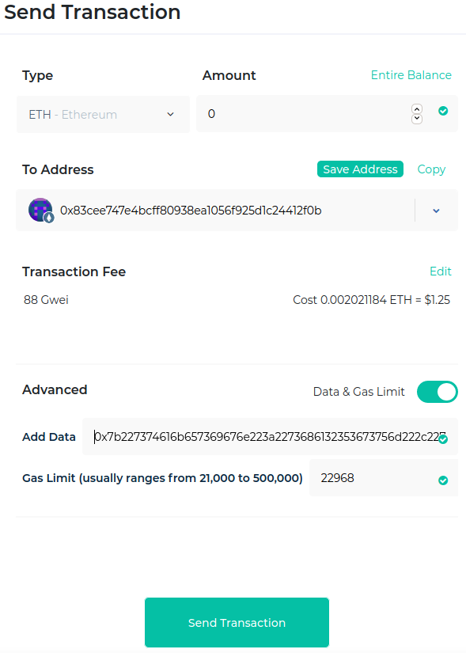

# Signing with MyEtherWallet

`stakesign prepare` formulates the "input data" for you to sign and send in a public Ethereum transaction.

```
$ stakesign prepare --stake 0.42 LICENSE
Trusting local exe:	/usr/bin/sha256sum

{"stakesign":"sha256sum","stakeAd":{"ETH":0.42}}
2f91a6f33f4f2d72ed4cd6c363f1e72cddd726b4d35c2af35356f256a54e75a0  LICENSE

-- Transaction input data for signing (one long line):

0x7b227374616b657369676e223a2273686132353673756d222c227374616b654164223a7b22455448223a302e34327d7d0a3266393161366633336634663264373265643463643663333633663165373263646464373236623464333563326166333533353666323536613534653735613020204c4943454e53450a

```

Here's how to complete the process in the [MyEtherWallet](https://www.myetherwallet.com/) web application (which you usually team up with a secure key management device, like your smartphone or hardware wallet). Get yourself set up with the appropriate amount of ETH loaded, including some extra to pay transaction fees, and enter the **Send Transaction** dialog. Here's a screenshot from when I actually sent the LICENSE signature used as this project's introductory example:



1. Leave **Amount** at zero, it's irrelevant
2. Put your own address in **To Address**, or any other ETH address
3. Set **Transaction Fee** as you like it
4. Toggle the **Data & Gas Limit** slider
5. Paste the lengthy 0x... text for **Add Data**
    * It should be one long line, even if it wraps in your terminal
    * MEW's little green checkmark on the text box may obscure the rightmost character of the paste; rest assured it's there, unless you hit backspace by accident
6. Click **Send Transaction**.
7. You'll be asked to sign the transaction on your secure device, then **Confirm and Send**

You'll then get a receipt with the [Transaction ID](https://etherscan.io/tx/0xd071c0e8fbcbcab8b92f9098c5250d7e1c003f222c94fe0729669bae02ae3acf) (txhash), which you'll be able to `stakesign verify` within a few minutes (depending on network weather).

Congratulations!

